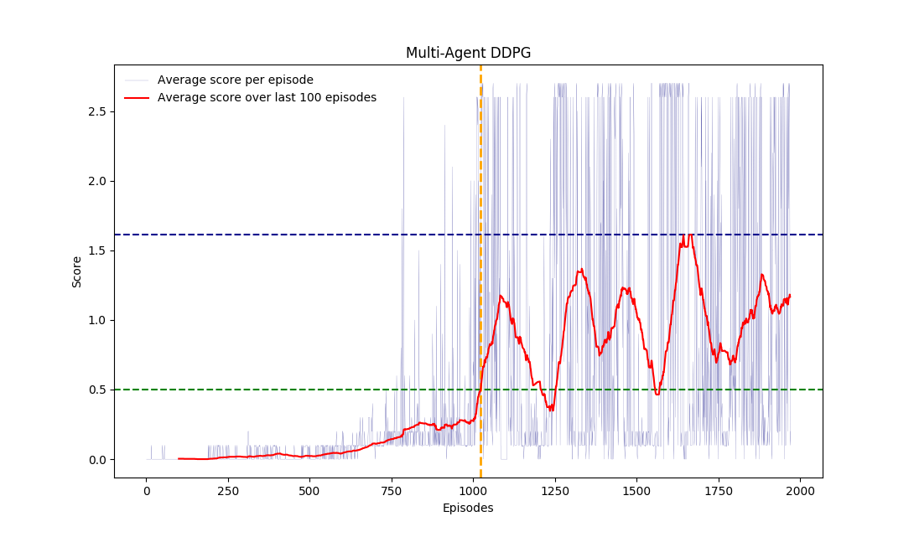
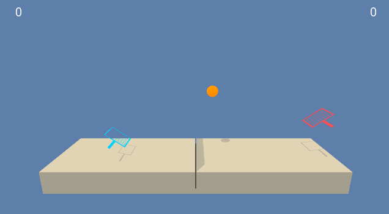

## Udacity Deep Reinforcement Learning Nanodegree 
## Project 3: Collaboration & Competition

### Description of Implementation

The environment is solved using a multi-agent deep deterministic policy gradient (DDPG) algorithm. Training proceeds as follows:

1. The 2 agents each receive a different state vector (with 24 elements) from the environment
1. Each agent feeds its state vector through the local actor network to get an action vector (with 2 elements) as output. Noise based on an Ornstein-Uhlenbeck process is added to the predicted actions to encourage exploration
1. Each agent then receives a next state vector and a reward from the environment (as well as a termination signal that indicates if the episode is complete)
1. The experience tuple `(state, action, reward, next state)` of each agent is added to a common replay buffer
1. A random sample of experience tuples is drawn from the replay buffer (once it contains enough) 
1. The sample is used to update the weights of the local critic network:
    1. The next state is fed into the target actor to obtain the next action
    1. The (next state, next action) pair is fed into the target critic to obtain an action value, Q_next
    1. The action value for the current state is then computed as Q_cur = reward + gamma*Q_next
    1. The (current state, current action) pair are fed into the local critic to obtain a predicted action value, Q_pred
    1. The MSE loss is computed between Q_cur and Q_pred, and the weights of the local critic are updated accordingly
1. The sample is used to update the weights of the local actor network:
    1. The current state is fed into the local actor to obtain predicted a action
    1. Each (current state, predicted action) pair for the sample is fed into the local critic to obtain action values
    1. The negative mean of the predicted Q values is used as a loss function to update the weights of the local actor
1. The target actor and critic networks are then soft-updated by adjusting their weights slightly toward those of their local counterparts
1. The states that were obtained in step (3) then become the current states for each agent and the process repeats from step (2)

#### Learning Algorithms

This project uses an *off-policy method* called **Multi Agent Deep Deterministic Policy Gradient (MADDPG)** algorithm.

### Background for Deep Deterministic Policy Gradient (DDPG)

MADDPG find its origins in an *off-policy method* called **Deep Deterministic Policy Gradient (DDPG)** and described in the paper [Continuous control with deep reinforcement learning](https://arxiv.org/abs/1509.02971). 

> We adapt the ideas underlying the success of Deep Q-Learning to the continuous action domain. We present an actor-critic, model-free algorithm based on the deterministic policy gradient that can operate over continuous action spaces. Using the same learning algorithm, network architecture and hyper-parameters, our algorithm robustly solves more than 20 simulated physics tasks, including classic problems such as cartpole swing-up, dexterous manipulation, legged locomotion and car driving. Our algorithm is able to find policies whose performance is competitive with those found by a planning algorithm with full access to the dynamics of the domain and its derivatives. We further demonstrate that for many of the tasks the algorithm can learn policies end-to-end: directly from raw pixel inputs.

Deep Deterministic Policy Gradient (DDPG) is an algorithm which concurrently learns a Q-function and a policy. It uses off-policy data and the Bellman equation to learn the Q-function, and uses the Q-function to learn the policy.

More details available on the Open AI's [Spinning Up](https://spinningup.openai.com/en/latest/algorithms/ddpg.html) website.

This algorithm screenshot is taken from the [DDPG algorithm from the Spinning Up website](https://spinningup.openai.com/en/latest/algorithms/ddpg.html)

### Multi Agent Deep Deterministic Policy Gradient (MADDPG)

For this project I have used a variant of DDPG called **Multi Agent Deep Deterministic Policy Gradient (MADDPG)** which is  described in the paper [Multi-Agent Actor-Critic for Mixed Cooperative-Competitive Environments](https://arxiv.org/abs/1706.02275)

> We explore deep reinforcement learning methods for multi-agent domains. We begin by analyzing the difficulty of traditional algorithms in the multi-agent case: Q-learning is challenged by an inherent non-stationarity of the environment, while policy gradient suffers from a variance that increases as the number of agents grows. We then present an adaptation of actor-critic methods that considers action policies of other agents and is able to successfully learn policies that require complex multi-agent coordination. Additionally, we introduce a training regimen utilizing an ensemble of policies for each agent that leads to more robust multi-agent policies. We show the strength of our approach compared to existing methods in cooperative as well as competitive scenarios, where agent populations are able to discover various physical and informational coordination strategies.

 (screenshot from the paper)

The main concept behind this algorithm is summarized in this illustration taken from the paper :

 (screenshot from the paper)

> we accomplish our goal by adopting the framework of centralized training with
decentralized execution. Thus, we allow the policies to use extra information to ease training, so
long as this information is not used at test time. It is unnatural to do this with Q-learning, as the Q
function generally cannot contain different information at training and test time. Thus, we propose
a simple extension of actor-critic policy gradient methods where the critic is augmented with extra
information about the policies of other agents.

In short, this means that during the training, the Critics networks have access to the states and actions information of both agents, while the Actors networks have only access to the information corresponding to their local agent.

#### Agent Hyperparameters

- `GAMMA = 0.99` is the discount factor that controls how far-sighted each agent is with respect to rewards. `GAMMA = 0` implies that only the immediate reward is important and `GAMMA = 1.0` implies that all rewards are equally important, irrespective whether they are realised soon and much later
- `TAU = 0.001` controls the degree to which the target network parameters are adjusted toward those of the local network. `TAU = 0` implies no adjustment (the target network does not ever learn) and `TAU = 1` implies that the target network parameters are completely replaced with the local network parameters
- `LR_ACTOR = 0.001` is the learning rate for the gradient descent update of the local actor weights
- `LR_CRITIC = 0.001` is the learning rate for the gradient descent update of the local critic weights
- `BUFFER_SIZE = 100000` is the number of experience tuples `(state, action, reward, next_state, done)` that are stored in the replay buffer and avaiable for learning
- `BATCH_SIZE = 128` is the number of tuples that are sampled from the replay buffer for learning
- During training, the predicted actions were corrupted with noise based on an Ornstein-Uhlenbeck process with mean `mu = 0`, mean reversion rate `theta = 0.15` and variance `sigma = 0.1` 

#### Network Architectures and Hyperparameters

The actor network takes a state vector (24 elements) as input and returns an action vector (2 elements). It was modelled with a feedforward deep neural network comprising a 24 dimensional input layer, two hidden layers with 128 neurons and ReLU activations and a 2 dimensional output layer with a tanh activation to ensure that the predicted actions are in the range -1 to +1. Batch normalisation was applied to the input and two hidden layers. 

The critic network takes the state and action vectors as input, and returns a scalar Q value as output. It was modelled with a feedforward deep neural network with a 24 dimensional input layer (for the state vector) that was fully connected to 128 neurons in the first hidden layer with ReLU activations. The outputs of the first layer were batch normalised and concatenated with the 2 dimensional action vector as input to the second hidden layer, which also comprised 128 neurons with ReLU activations. Finally, the second hidden layer mapped to an output layer with single neuron and linear activation (outputs a single real number). 

### Results

The 2 agents were trained for 2000 episodes. An average score greater than 0.5 over the last 100 episodes was first obtained at episode 1025 (average = 0.52). The best average score of 1.61 was obtained after 1567 episodes (averaged over episodes 1468 to 1567). The actor and critic weights corresponding to these agents is stored in the code folder. Although the average exceeds the target +0.5, it is clear from the plot below that there is a lot of variation in the score from episode to episode. The dashed vertical line indicates the point at which the enviroment was considered solved. The dashed horizontal lines indicate the target threshold (in green) and the maximum score obtained over the 2000 episodes (navy).

Here are the trained agents playing a game of tennis:

### Future Plans for Improvement

The performance of the agents might be improved by considering the following:

- Consider procedures to reduce the episode-to-episode variation
  
  I tried decaying the Ornstein-Uhlenbeck noise exponentially over the episodes (with rate 0.998), but this did not seem to help with reducing the variation (the maximum score and time to solve the environment also remained roughly the same). I could try decaying the noise more rapidly to see if this reduces the variation (at the expense of exploration).

- Hyperparameter optimisation 

  Many of the hyperparameters, such as the network architectures (number of layers and neurons), learning rates, batch and buffer sizes, and the level of noise, could be further tuned to improve performance.

- Alternative learning algorithms

  Alternative methods include PPO with team spirit and the multi-agent DDPG algorithm described  that uses centralised training and decentralised execution. 

